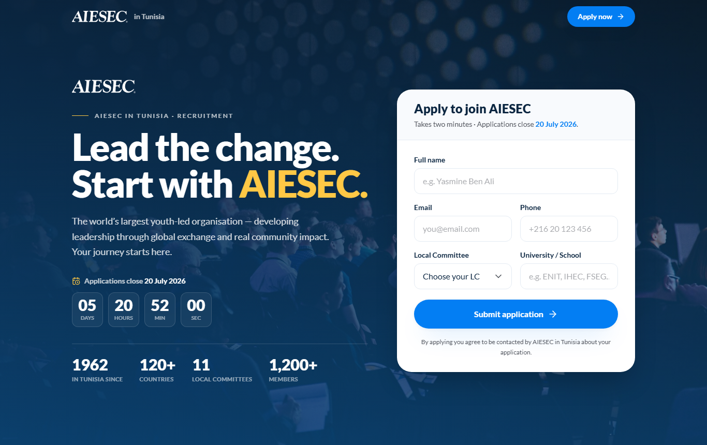

# AIESEC in Tunisia — Recruitment Microsite

An elegant, single-page recruitment website for **AIESEC in Tunisia**. Visitors
learn what AIESEC is, then apply through a validated form whose submissions land
directly in a **Google Sheet**. Built with **React + TypeScript + Vite**, styled
with **Tailwind CSS v4** using the official AIESEC Blue Book brand system, and
deployed on **Vercel**.



## ✨ Features

- **Opening splash** — a full-screen AIESEC-blue intro with an animated walking
  figure that plays once, then fades to reveal the site (`IntroSplash`).
- **On-brand design** — the official **AIESEC** wordmark, Blue `#037EF3`, the
  secondary palette, and the **Lato** typeface (self-hosted), over a full-bleed
  conference/leadership photo.
- **Live deadline countdown** — applications close **20 July 2026**; a ticking
  counter in the hero, and the form auto-closes after the deadline (`Countdown`).
- **Application form** — Full name, Email, Phone, **Local Committee** (Tunisia
  LCs), and University, with real-time **client-side validation** (react-hook-form
  + zod), including Tunisian phone-number rules.
- **Google Sheets storage** — submissions POST to a Google Apps Script Web App
  that appends a row to your sheet. No database to run.
- **Accessible & responsive** — semantic landmarks, keyboard focus rings, skip
  link, `aria-invalid`/`aria-describedby`, and `prefers-reduced-motion` support.
- **Tasteful motion** — restrained scroll reveals and micro-interactions via
  Framer Motion.

## 🧱 Tech stack

| Concern | Choice |
| --- | --- |
| Language | TypeScript |
| Framework | React 18 + Vite 6 |
| Styling | Tailwind CSS v4 (`@tailwindcss/vite`) |
| Forms / validation | react-hook-form + zod |
| Animation | Framer Motion |
| Typeface | Lato (`@fontsource/lato`) |
| Backend | Google Apps Script Web App |
| Hosting | Vercel |

## 📁 Project structure

```
├─ public/
│  ├─ favicon.svg
│  ├─ aiesec-logo.png          # official AIESEC wordmark (transparent)
│  ├─ hero-conference.jpg      # swap for an official AIESEC photo
│  ├─ intro-walk.mp4 / .webm   # opening splash animation
│  └─ ...
├─ src/
│  ├─ main.tsx                 # entry + Lato font imports
│  ├─ App.tsx                  # composition: IntroSplash → NavBar → Hero → Footer
│  ├─ index.css                # Tailwind + AIESEC theme tokens
│  ├─ data/localCommittees.ts  # the LC dropdown list (edit here)
│  ├─ lib/
│  │  ├─ schema.ts             # zod schema + validation rules
│  │  └─ submit.ts             # POST to the Apps Script endpoint
│  └─ components/              # IntroSplash, NavBar, Hero, Countdown, RecruitmentForm, Field, Footer, …
├─ google-apps-script/Code.gs  # paste into your Sheet's Apps Script
├─ design-assets/              # original uploads (git-ignored; web files live in /public)
└─ .env.example                # VITE_APPS_SCRIPT_URL
```

## 🚀 Local development

```bash
npm install
cp .env.example .env.local      # then paste your Apps Script URL
npm run dev                     # http://localhost:5173
```

Other scripts: `npm run build` (typecheck + production build), `npm run preview`
(serve the build), `npm run typecheck`.

> The form works before the backend is set up — it will simply show a friendly
> "not configured yet" message until `VITE_APPS_SCRIPT_URL` is set.

## 📊 Connect Google Sheets (one-time)

1. Create a Google Sheet (any name).
2. **Extensions → Apps Script**, delete the boilerplate, and paste the contents
   of [`google-apps-script/Code.gs`](google-apps-script/Code.gs).
3. **Deploy → New deployment → Web app**
   - *Execute as:* **Me**
   - *Who has access:* **Anyone**
4. Authorise when prompted, then copy the **Web app URL** (ends with `/exec`).
5. Put that URL in `.env.local`:
   ```
   VITE_APPS_SCRIPT_URL=https://script.google.com/macros/s/XXXXX/exec
   ```

The `Submissions` sheet and its header row are created automatically on the first
submission.

> **Why `Content-Type: text/plain`?** The client posts JSON as plain text so the
> request stays a CORS "simple request" and the browser skips the preflight
> `OPTIONS` call that Apps Script doesn't answer. The script still receives the
> raw JSON in `e.postData.contents`.

## ▲ Deploy to Vercel

1. Push this repo to GitHub and **Import** it at [vercel.com/new](https://vercel.com/new).
   Vercel auto-detects Vite (build `npm run build`, output `dist`).
2. **Project → Settings → Environment Variables** → add
   `VITE_APPS_SCRIPT_URL` for **Production, Preview, and Development**.
3. Deploy. Submit a test application and confirm a new row appears in your Sheet.

Or from the CLI:

```bash
npm i -g vercel
vercel                          # link + preview deploy
vercel env add VITE_APPS_SCRIPT_URL
vercel --prod
```

## 🎨 Customising

- **Local Committees** — edit `src/data/localCommittees.ts` (single source of
  truth). ⚠️ Verify the names against the current official roster before launch.
- **Deadline** — edit the `DEADLINE` constant in `src/components/Countdown.tsx`. The
  hero countdown and the form's auto-close both read from it.
- **Hero photo** — replace `public/hero-conference.jpg` (a wide landscape crop works
  best for the full-bleed hero) with an official AIESEC Tunisia photo.
- **Intro animation** — replace `public/intro-walk.mp4` / `.webm` (composited over
  AIESEC blue `#037EF3`). Timing lives in `src/components/IntroSplash.tsx`.
- **Logo** — `public/aiesec-logo.png` is the official transparent **AIESEC** wordmark;
  `src/components/Logo.tsx` inverts it to white on dark surfaces.
- **Extra fields** — add to the zod schema in `src/lib/schema.ts`, the form in
  `RecruitmentForm.tsx`, and the `HEADERS`/`appendRow` in `Code.gs`.

## 🎯 Brand reference

Primary Blue `#037EF3` · Sunset Orange `#F85A40` · Jade `#00C16E` · Golden Yellow
`#FFC845` · Grape `#7552CC`. Typeface: **Lato**. Source: AIESEC Blue Book brand
guidelines.
